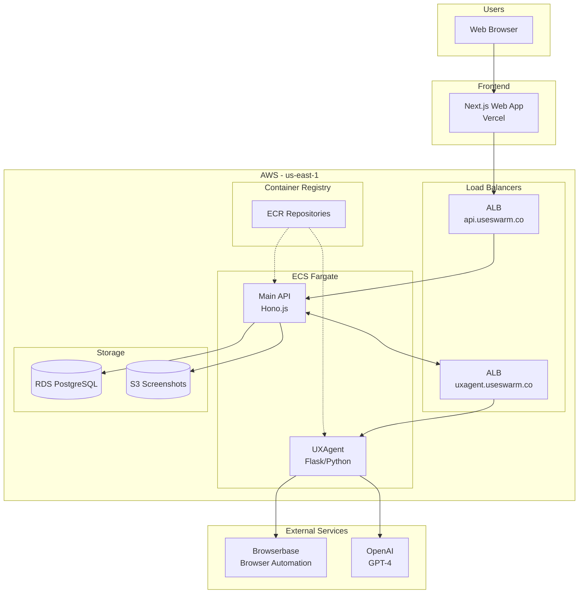
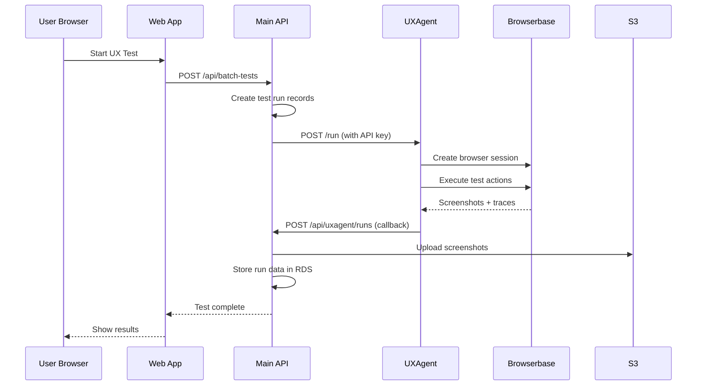

# System Architecture - UX Testing Platform

## High-Level Overview



---

## Component Details

### 1. Frontend (Vercel)
| | |
|---|---|
| **URL** | `https://useswarm.co` |
| **Tech** | Next.js 15, React, TailwindCSS |
| **Auth** | Better-Auth (sessions stored in RDS) |

### 2. Main API (ECS Fargate)
| | |
|---|---|
| **URL** | `https://api.useswarm.co` |
| **Tech** | Hono.js, Drizzle ORM, Node.js 20 |
| **Cluster** | `ux-testing-api-cluster` |
| **Service** | `ux-testing-api-service` |

**Responsibilities:**
- User authentication & sessions
- Test run management
- UXAgent orchestration
- Screenshot storage (→ S3)
- Report generation & aggregation

### 3. UXAgent (ECS Fargate)
| | |
|---|---|
| **URL** | `https://uxagent.useswarm.co` |
| **Tech** | Flask, Python 3.11, Playwright |
| **Cluster** | `ux-testing-api-cluster` |
| **Service** | `uxagent-service` |

**Responsibilities:**
- Browser automation via Browserbase
- AI-driven UX testing with personas
- Action trace & observation logging
- Callback results to Main API

### 4. RDS PostgreSQL
| | |
|---|---|
| **Host** | `ux-testing-api-db.cwxc0m8u27di.us-east-1.rds.amazonaws.com` |
| **Instance** | `db.t4g.micro` |
| **Database** | `ux_testing` |

**Tables:**
- `user`, `account`, `session`, `verification` (auth)
- `test_runs`, `batch_test_runs` (tests)
- `reports`, `aggregated_reports` (results)
- `screenshots`, `uxagent_screenshots` (S3 refs)
- `api_keys` (service auth)
- `swarms` (persona groups)

### 5. S3 Screenshots Bucket
| | |
|---|---|
| **Bucket** | `ux-testing-api-screenshots-490863269891` |
| **Lifecycle** | 90-day expiration |
| **Access** | Private, presigned URLs |

---

## Request Flow



---

## Environment Variables

### Main API
```
DATABASE_URL          → RDS connection
S3_BUCKET_NAME        → Screenshot storage
UXAGENT_API_URL       → UXAgent endpoint
UXAGENT_API_KEY       → Auth key for UXAgent
BROWSERBASE_API_KEY   → Browser automation
OPENAI_API_KEY        → AI models
```

### UXAgent
```
INTERNAL_API_KEY      → Validates requests from Main API
MAIN_API_URL          → Main API callback endpoint
MAIN_API_KEY          → Auth key for callbacks
BROWSERBASE_API_KEY   → Browser automation
OPENAI_API_KEY        → AI models
```

---

## Deployment Commands Cheatsheet

```bash
# Main API
cd apps/api/infra && sudo terraform apply
docker build --platform linux/amd64 -t ux-testing-api -f apps/api/Dockerfile .
docker push 490863269891.dkr.ecr.us-east-1.amazonaws.com/ux-testing-api:latest
aws ecs update-service --cluster ux-testing-api-cluster --service ux-testing-api-service --force-new-deployment

# UXAgent
cd apps/UXAgent-master/infra && sudo terraform apply
docker build --platform linux/amd64 -t uxagent .
docker push 490863269891.dkr.ecr.us-east-1.amazonaws.com/uxagent:latest
aws ecs update-service --cluster ux-testing-api-cluster --service uxagent-service --force-new-deployment

# Schema changes
cd packages/db && DATABASE_URL="...?sslmode=require" pnpm push
```
