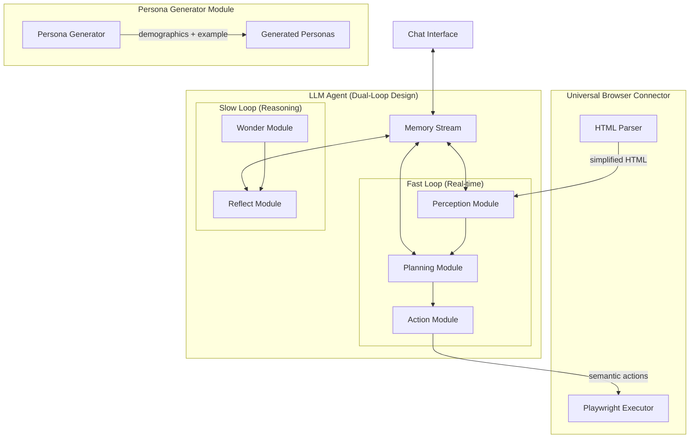

# UXAgent Architecture & Improvement Analysis

## How UXAgent Currently Works

Based on the research paper (CHI EA '25) and codebase analysis, UXAgent is an LLM-agent-based system for automating usability testing with the following architecture:

### Core Components



### Agent Architecture (Kahneman-Inspired)

1. **Fast Loop** - Quick, reactive interactions
   - `perceive()` - Observes HTML, outputs natural language description
   - `plan()` - Creates/updates step-by-step plan based on memories
   - `act()` - Translates plan step to browser action (click, type, etc.)

2. **Slow Loop** - Deep reasoning  
   - `wonder()` - Generates random thoughts (simulates "mind drifting")
   - `reflect()` - High-level insights and strategic guidance

3. **Memory Stream** - Stores observations, actions, reflections with:
   - Importance scoring
   - Relevance matching
   - Recency weighting

---

## Current Limitations (from paper & code)

| Limitation | Impact | Current State |
|------------|--------|---------------|
| **Text-only perception** | Misses visual layout, colors, images | Parser only extracts HTML text, no visual analysis |
| **Shopping-focused prompts** | Limited to "buy X" intents | Prompts optimized for shopping tasks |
| **Limited action space** | Can't scroll, read, hover properly | Only click, type, back, terminate working well |
| **No accessibility testing** | Ignores screen reader compatibility | No ARIA role analysis |
| **Single session memory** | No learning across runs | Memory cleared between runs |
| **No UX heuristic scoring** | Just tracks task completion | No Nielsen heuristics evaluation |

---

## Improvement Recommendations

### 1. 🎯 **Add Multimodal Perception (HIGH PRIORITY)**

Replace text-only HTML parsing with vision-language models to understand:
- Visual hierarchy and layout
- Color contrast issues
- Visual focus states
- Image/icon understanding

```python
# In perceive.txt prompt, add:
"""
You will also receive a screenshot of the current page.
Analyze BOTH the HTML structure AND the visual appearance:
- Is the call-to-action button visually prominent?
- Are there color contrast issues?
- Is the visual hierarchy clear?
- Are focus states visible?
"""
```

### 2. 🧠 **Create UX-Specific Prompts (HIGH PRIORITY)**

Current prompts are shopping-focused. Create general UX testing prompts:

```python
# ux_prompts/perceive_ux.txt
"""
Observe this page from a UX perspective. Evaluate:
1. Visual Clarity: Is the purpose of the page immediately clear?
2. Navigation: Can you easily find main navigation elements?
3. Forms: Are labels clear? Are errors helpful?
4. Loading: Does content appear quickly?
5. Accessibility: Are there aria labels? Keyboard-friendly?

Rate your first impression (1-10) before taking any action.
"""
```

### 3. 📊 **Add UX Heuristic Scoring**

Implement Nielsen's 10 Usability Heuristics as evaluation criteria:

```python
UX_HEURISTICS = {
    "visibility_of_system_status": "Does the system show what's happening?",
    "match_real_world": "Does language match user expectations?",
    "user_control_freedom": "Can users undo/redo easily?",
    "consistency_standards": "Are elements consistent?",
    "error_prevention": "Does design prevent errors?",
    "recognition_over_recall": "Are options visible vs memorized?",
    "flexibility_efficiency": "Are shortcuts available for experts?",
    "aesthetic_minimal": "Is information relevant, not cluttered?",
    "error_recovery": "Are error messages helpful?",
    "help_documentation": "Is help available when needed?"
}
```

### 4. 🎭 **Expand Persona Diversity for UX Testing**

Current personas focus on demographics. Add UX-relevant attributes:

```python
UX_PERSONA_ATTRIBUTES = {
    # Cognitive
    "attention_span": ["short", "medium", "long"],
    "reading_level": ["basic", "intermediate", "advanced"],
    "tech_familiarity": ["novice", "intermediate", "expert"],
    
    # Accessibility
    "visual_impairment": ["none", "low_vision", "colorblind"],
    "motor_impairment": ["none", "limited_dexterity"],
    "cognitive_load_tolerance": ["low", "medium", "high"],
    
    # Behavioral
    "patience_level": ["impatient", "moderate", "patient"],
    "exploration_style": ["goal_focused", "exploratory"],
    "error_tolerance": ["gives_up_quickly", "persistent"]
}
```

### 5. 📱 **Add Responsive Testing**

Test at multiple viewport sizes:

```python
VIEWPORTS = [
    {"name": "mobile", "width": 375, "height": 667},
    {"name": "tablet", "width": 768, "height": 1024},
    {"name": "desktop", "width": 1440, "height": 900},
]
```

### 6. 🔄 **Implement Scroll & Read Actions**

Expand action space (paper acknowledges this limitation):

```python
# Add to action.txt
NEW_ACTIONS = """
## Scroll
{ "action": "scroll", "direction": "down", "amount": 500, "description": "Scrolling to see more content..." }

## Read/Dwell
{ "action": "read", "duration_ms": 3000, "description": "Reading the content carefully..." }

## Focus (for accessibility testing)
{ "action": "tab_focus", "times": 1, "description": "Using keyboard to focus next element..." }
"""
```

### 7. 📋 **Add Structured UX Report Generation**

Create a post-session analysis that generates:

```json
{
  "session_summary": {
    "task_completed": true,
    "time_to_completion": 45000,
    "error_count": 2,
    "confusion_points": ["checkout button hard to find", "form validation unclear"]
  },
  "heuristic_scores": {
    "visibility_of_system_status": 7,
    "user_control_freedom": 5,
    ...
  },
  "issues_found": [
    {
      "severity": "high",
      "location": "checkout page",
      "description": "Submit button not visible without scrolling",
      "recommendation": "Make CTA sticky or more prominent"
    }
  ],
  "positive_aspects": [
    "Clear navigation structure",
    "Fast page load times"
  ]
}
```

### 8. ⏱️ **Add Timing Metrics**

Track user behavior patterns:

```python
TIMING_METRICS = {
    "time_to_first_action": None,
    "time_per_page": [],
    "hesitation_moments": [],  # Long pauses before action
    "backtrack_count": 0,
    "rage_click_detection": False,  # Multiple rapid clicks
}
```

---

## Implementation Priority

| Priority | Improvement | Effort | Impact |
|----------|-------------|--------|--------|
| 🔴 High | Multimodal perception (screenshots) | Medium | Very High |
| 🔴 High | UX-focused prompts | Low | High |
| 🔴 High | Heuristic scoring | Medium | High |
| 🟡 Medium | Expanded personas | Low | Medium |
| 🟡 Medium | Scroll/Read actions | Medium | Medium |
| 🟡 Medium | Responsive testing | Low | Medium |
| 🟢 Low | Timing metrics | Low | Medium |
| 🟢 Low | Cross-session learning | High | Medium |

---

## Quick Wins (Can implement today)

1. **Update `perceive.txt`** to ask UX-specific questions
2. **Add UX scoring** in the `reflect()` module
3. **Create new persona attributes** for accessibility testing
4. **Add viewport testing** parameter to experiment.py
5. **Generate structured report** at end of session

Would you like me to implement any of these improvements?
